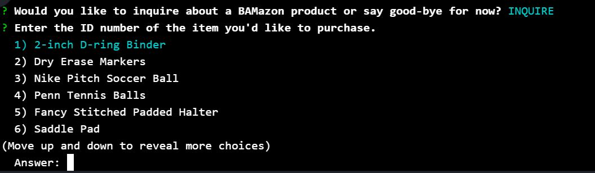
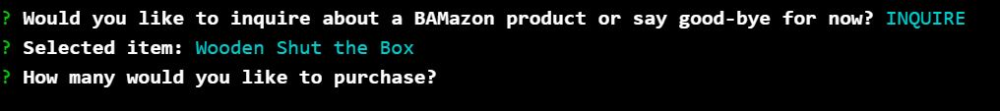
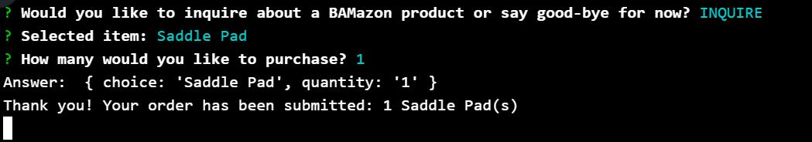
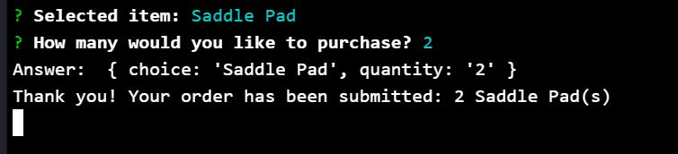
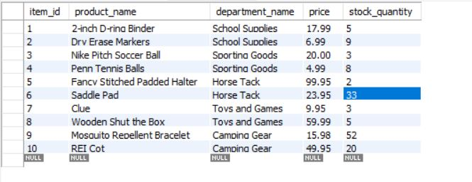

# bamazon
Author: Amy Volkert
Created:  2017 Aug 4
Modified: 2017 Aug 21

# Overview

The purpose of this application is to allow the user to view, select, and purchase items from a storefront.

The application utilizes Node, MySQL, and Inquirer.

# Functionality

The user first receives a prompt to either inquire about a product or exit the storefront.

If the user chooses to exit, then the following is displayed:

If the user chooses to inquire about a product, then a list of products is displayed. The user may scroll through the products using the up and down arrow keys.

After the user selects a product, he is prompted to enter a desired quantity.

If the MySQL database contains enough product of the item chosen, then the user's order is submitted.

If the MySQL database does not contain enough product of the item chosen, then the user's order is declined, and the user is again prompted to inquire or exit.

# Database

The MySQL database is set up as follows. Note the stock_quantity of item id 6, Saddle Pad is 35.

When a user chooses to purchase 2 Saddle Pads, the stock_quantity of the item updates to 33.

